# 🤖 AI Agents & Multi-Agent Systems
*Architectures • Frameworks • Benchmarks • Ops Playbooks • Visual Storytelling with Nano Banana*

> **Status:** Living document • **License:** [CC BY 4.0](https://creativecommons.org/licenses/by/4.0/) • **Last Updated:** November 2025

<p align="center">
  <a href="https://github.com/">
    
  </a>
  <a href="https://github.com/">
    
  </a>
  <a href="https://github.com/">
    
  </a>
</p>

---

## 📌 Executive Summary

This comprehensive report synthesizes actionable patterns for developing robust, controllable **autonomous AI agents** and **multi-agent systems (MAS)** suitable for production environments. Informed by hands-on deployments and cutting-edge research, it focuses on architectures that balance auditability, scalability, and inherent safety to mitigate risks in dynamic real-world applications.

### **Key Takeaways**
- **Framework Selection is Critical:** Choose based on use case—**LangGraph** excels in auditable, stateful workflows with graph-based control; **AutoGen** shines in collaborative, human-in-the-loop (HITL) enterprise settings; **CrewAI** enables rapid prototyping via intuitive role- and task-driven pipelines.
- **Architecture Trumps Model Choice:** Implementing a refined PRAL cycle (**Perception → Reasoning → Action → Learning**) augmented by layered memory (episodic, semantic, procedural) enhances long-term task reliability by 8–15%, fostering adaptive, self-improving systems.
- **Embed Guardrails in Design:** Model approvals, budgets, and circuit breakers as graph edges to slash incident rates while preserving development momentum.
- **Prioritize Operational Excellence:** Techniques like cost optimization, tool access controls, and iterative plan repairs can cut tail-end (p95) latencies by 30–50%, shifting from intuition-driven to data-backed operations.
- **Evolve Evaluation Practices:** Move beyond simple accuracy metrics to holistic assessment of **reasoning fidelity**, **tool invocation success**, **plan recovery efficiency**, and **inter-agent collaboration metrics** for true system maturity.

---

## 🧭 Contents
1. [Introduction & Context](#1-🔰-introduction--context)
2. [AI Agent Architecture Fundamentals](#2-🧠-ai-agent-architecture-fundamentals)
3. [Comparative Framework Analysis](#3-🧰-comparative-framework-analysis)
4. [Multi-Agent Design Patterns](#4-🕸️-multi-agent-design-patterns)
5. [Evaluation Methodologies & Benchmarks](#5-📏-evaluation-methodologies--benchmarks)
6. [Nano Banana: Visual Research Workflows](#6-🎨-nano-banana-visual-research-workflows)
7. [Production Implementation Guide](#7-🚀-production-implementation-guide)
8. [Real-World Applications](#8-🧪-real-world-applications)
9. [Future Research Directions](#9-🔭-future-research-directions)
10. [Memory Systems & Knowledge Integration](#10-🧩-memory-systems--knowledge-integration)
11. [Safety, Governance & Risk](#11-🛡️-safety-governance--risk)
12. [Cost, Latency & Scaling](#12-⚡-cost-latency--scaling)
13. [Observability & Incident Response](#13-🔎-observability--incident-response)
14. [Reference Architectures](#14-🧭-reference-architectures)
15. [Playbooks & Checklists](#15-🧪-playbooks--checklists)
16. [Glossary](#-glossary)

---

## 1) 🔰 Introduction & Context

AI agents represent a paradigm shift, transforming rigid, deterministic software into **goal-oriented, adaptive entities** capable of navigating unpredictable, multifaceted environments with minimal human oversight.

```
Traditional Software: Input → Fixed Logic → Predictable Output
Agentic Systems: Goal → Perception → Reasoning → Action → Learning → Persistent Memory
```

<div style="text-align: center; margin: 30px 0; padding: 20px; border: 1px solid #e1e4e8; border-radius: 8px; background-color: #f6f8fa;">
  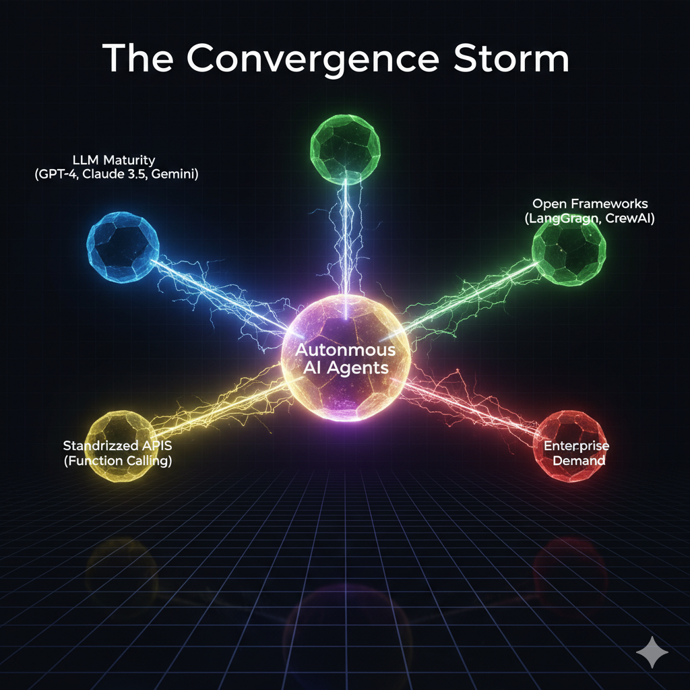
  <p style="margin-top: 15px; font-style: italic; color: #666;">Convergence of Forces Shaping Autonomous AI Agents</p>
</div>

---

## 2) 🧠 AI Agent Architecture Fundamentals

### 2.1 The Advanced PRAL Loop
Stateful agents that maintain context across iterations demonstrate superior reliability, supporting self-diagnosis, error recovery, and extended planning horizons essential for complex tasks.

- **Perception:** Ingest and parse diverse inputs, enforce schema validation, and flag uncertainties for escalation.
- **Reasoning:** Break down objectives into executable sub-plans, select optimal tools, apply self-critique, and dynamically *repair* flawed trajectories.
- **Action:** Invoke external tools through rigorously typed interfaces, ensuring idempotent operations to prevent cascading errors.
- **Learning:** Capture and distill episodes as `(action, result, outcome)` tuples for memory augmentation, enabling continuous refinement.

<div style="text-align: center; margin: 30px 0; padding: 20px; border: 1px solid #e1e4e8; border-radius: 8px; background-color: #f6f8fa;">
  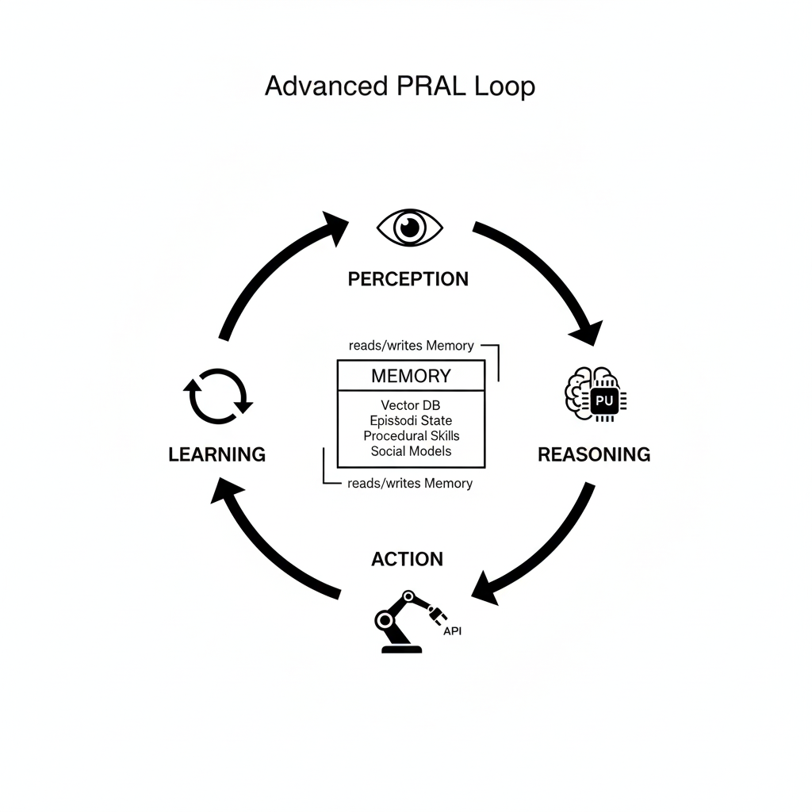
  <p style="margin-top: 15px; font-style: italic; color: #666;">Advanced PRAL Loop: Iterative Flow with Memory Integration</p>
</div>

### 2.2 Memory as a First-Class Citizen
Robust memory architectures transform agents from ephemeral responders into knowledge-rich, introspective entities:

- **Episodic Memory:** Captures transient task histories, logs, and states (short TTL; implemented via key-value stores like Redis).
- **Semantic Memory:** Houses structured knowledge, documents, and embeddings (medium TTL; vector databases like Chroma with hybrid filtering).
- **Procedural Memory:** Encodes reusable skills and macros as invocable routines (long TTL; centralized registry or database).
- **Social Memory:** Maps peer agent capabilities and interaction histories (medium TTL; graph databases for relational queries).

### 2.3 Reasoning Paradigms
Leverage these proven techniques to enhance decision-making depth:

- **Chain-of-Thought (CoT):** Prompts sequential, explicit reasoning for transparent problem-solving.
- **ReAct:** Alternates reasoning and action in a tight feedback loop, integrating tool observations dynamically.
- **Graph-of-Thoughts:** Explores parallel reasoning branches before merging for robust exploration.
- **Planner-Executor:** Employs lightweight planners to orchestrate heavyweight executors, optimizing compute.
- **Reflexion/Debate:** Incorporates self- or multi-agent critique to iteratively refine outputs and reduce hallucinations.

---

## 3) 🧰 Comparative Framework Analysis

<div style="text-align: center; margin: 30px 0; padding: 20px; border: 1px solid #e1e4e8; border-radius: 8px; background-color: #f6f8fa;">
  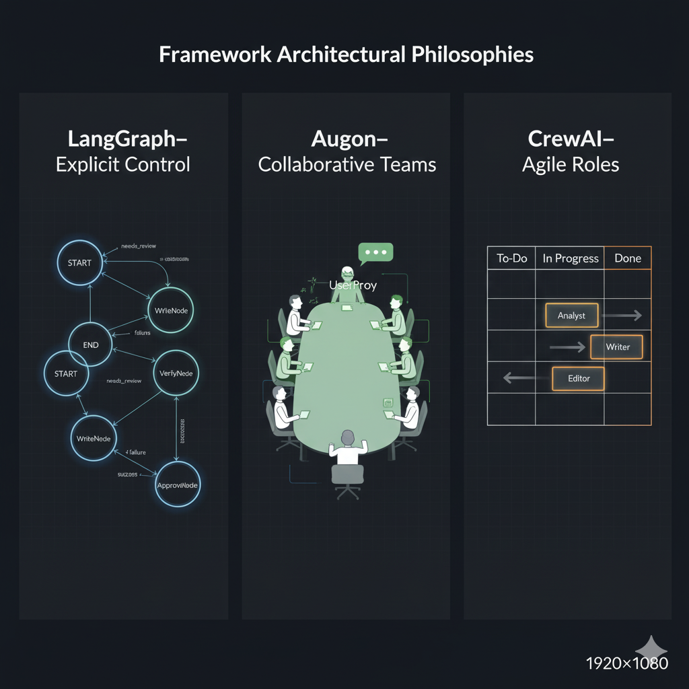
  <p style="margin-top: 15px; font-style: italic; color: #666;">Framework Philosophies: Visual Comparison</p>
</div>

| Dimension              | **LangGraph**                          | **AutoGen**                            | **CrewAI**                             |
|------------------------|----------------------------------------|----------------------------------------|----------------------------------------|
| **Primary Metaphor**   | State graph (nodes, edges, cycles)     | Conversational team (chat dynamics)    | Role-based tasks (hierarchical flow)   |
| **Control & Guardrails** | **Excellent** (policy-embedded edges) | Hooks and proxy mediation              | Custom scripting and validators        |
| **Loops & Resumability** | **Native** (persistent graph state)   | Chat history persistence               | Task-level checkpoints                 |
| **HITL Integration**   | Manual intervention nodes              | **Native** (UserProxy agents)          | Custom hooks and callbacks             |
| **Time-to-MVP**        | Medium (graph setup overhead)          | Medium (conversation tuning)           | **Fastest** (declarative configs)      |
| **Observability**      | Superior via LangSmith tracing         | Strong transcript logging              | Adapter-based metrics and logs         |

---

## 4) 🕸️ Multi-Agent Design Patterns

<div style="text-align: center; margin: 30px 0; padding: 20px; border: 1px solid #e1e4e8; border-radius: 8px; background-color: #f6f8fa;">
  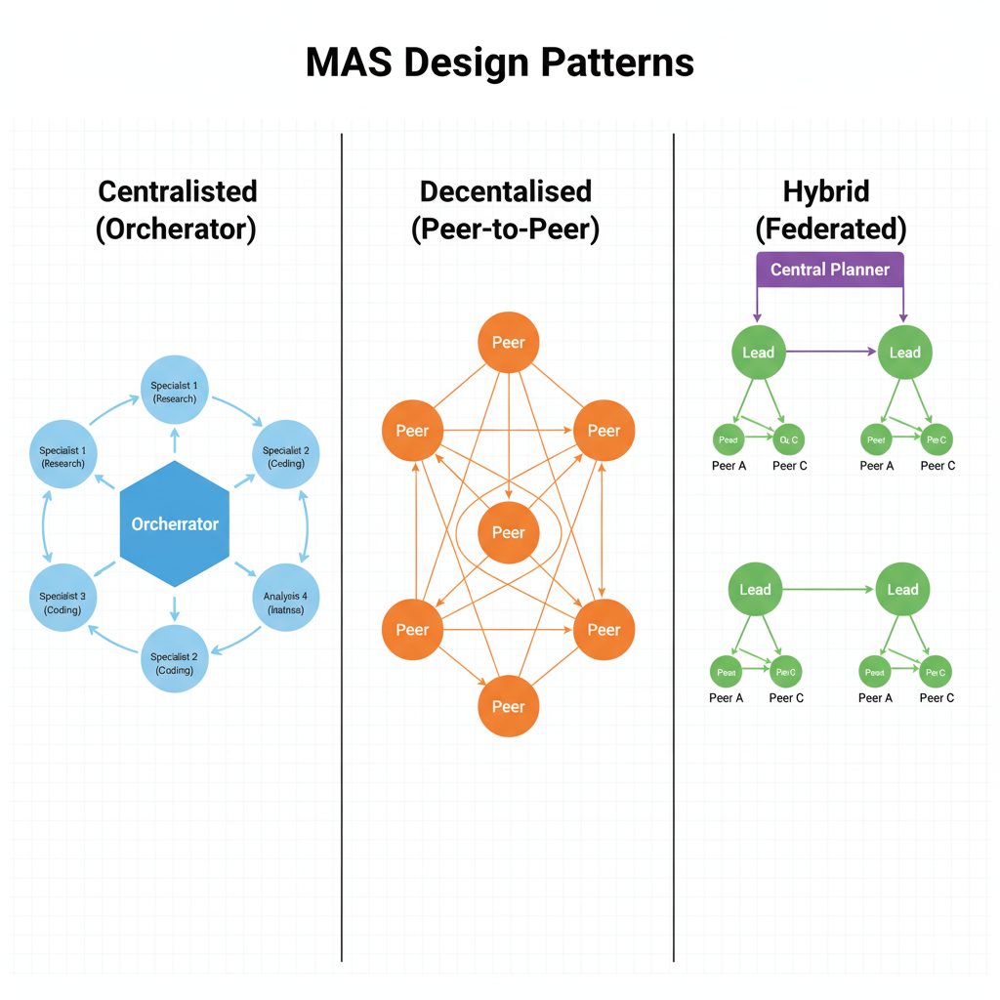
  <p style="margin-top: 15px; font-style: italic; color: #666;">Multi-Agent Design Patterns: Centralized, Decentralized, and Hybrid</p>
</div>

Proven patterns for orchestrating multi-agent interactions, balancing coordination with autonomy:

- **Centralized (Orchestrator-Led):** A single coordinator delegates tasks; ideal for governance but risks single points of failure.
- **Decentralized (P2P):** Agents communicate directly with **interest-based routing** to curb noise; promotes resilience in distributed scenarios.
- **Hybrid (Federated):** A high-level planner oversees semi-autonomous clusters; optimizes scalability for large-scale deployments.

**Common Anti-Patterns to Avoid:** Unbounded "all-to-all" communication (leads to chaos), monolithic prompts (erodes modularity), or unpartitioned global state (amplifies error propagation).

---

## 5) 📏 Evaluation Methodologies & Benchmarks

<div style="text-align: center; margin: 30px 0; padding: 20px; border: 1px solid #e1e4e8; border-radius: 8px; background-color: #f6f8fa;">
  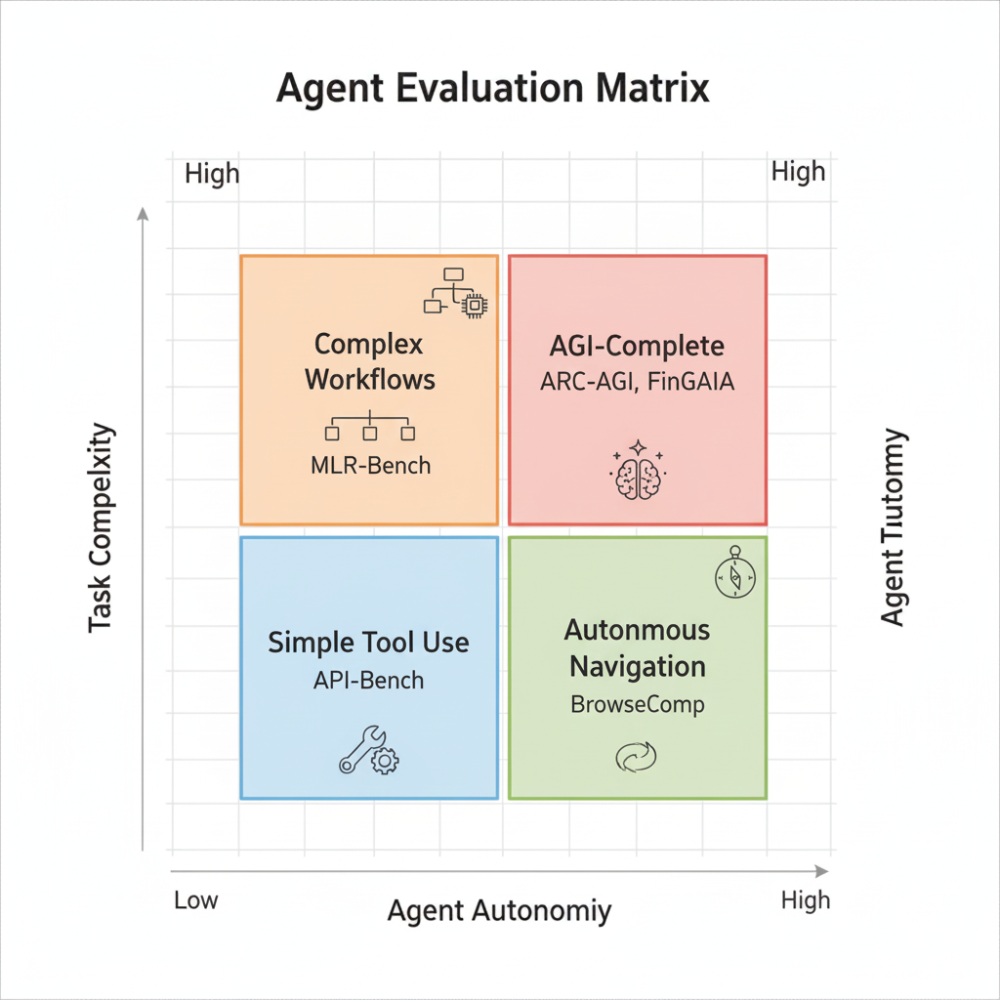
  <p style="margin-top: 15px; font-style: italic; color: #666;">Agent Evaluation Landscape: Complexity vs. Autonomy</p>
</div>

### 5.1 Core Metrics to Track
Shift to granular, actionable KPIs:

- **Task Success Rate:** (Successful completions / Total attempts) × 100.
- **Tool Success Rate:** (Valid invocations / Total calls), including recovery from failures.
- **Plan Repair Rate:** (Repaired plans / Attempted executions) for adaptive resilience.
- **Long-Horizon Persistence:** Success rate on resuming from checkpoints in multi-step tasks.
- **Collaboration Efficiency:** (Messages exchanged / Tasks completed) to minimize overhead.
- **Reasoning Fidelity:** Human-expert scoring (1–5 scale) for logical soundness.

### 5.2 Curated Benchmarks by Domain
- **Web Navigation:** BrowseComp, WebArena (simulate real-world browsing challenges).
- **General Reasoning:** ARC-AGI, Big-Bench Hard (BBH) (test abstract problem-solving).
- **Finance:** FinGAIA (financial analysis and decision-making).
- **Software Engineering:** SWE-Bench, CodeAct (code generation and debugging).
- **Agent/MAS-Specific:** AgentBench, MLR-Bench (multi-agent coordination and long-running tasks).

---

## 6) 🎨 Nano Banana: Visual Research Workflows

Nano Banana, leveraging Gemini 2.5 Flash, streamlines the creation of cohesive, high-fidelity diagrams—transforming abstract concepts into polished, reproducible visuals for technical reports and presentations.

<div style="text-align: center; margin: 30px 0; padding: 20px; border: 1px solid #e1e4e8; border-radius: 8px; background-color: #f6f8fa;">
  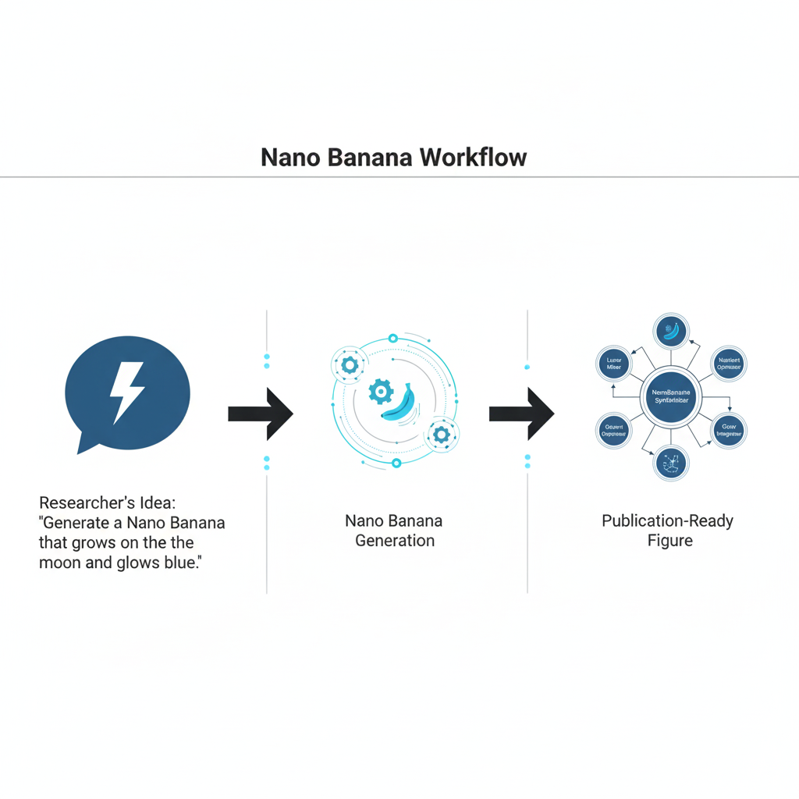
  <p style="margin-top: 15px; font-style: italic; color: #666;">Nano Banana Workflow: From Idea to Polished Visuals</p>
</div>

**Reproducibility Best Practices**
- **Figure Manifest:** Track IDs, prompts, seeds, and resolutions in a centralized log.
- **Style Sheet Lockdown:** Standardize color palettes, font weights, and labeling conventions.
- **Prompt Templating:** Use fillable slots (e.g., `{concept}`, `{style}`) for variant generation without drift.

---

## 7) 🚀 Production Implementation Guide

<div style="text-align: center; margin: 30px 0; padding: 20px; border: 1px solid #e1e4e8; border-radius: 8px; background-color: #f6f8fa;">
  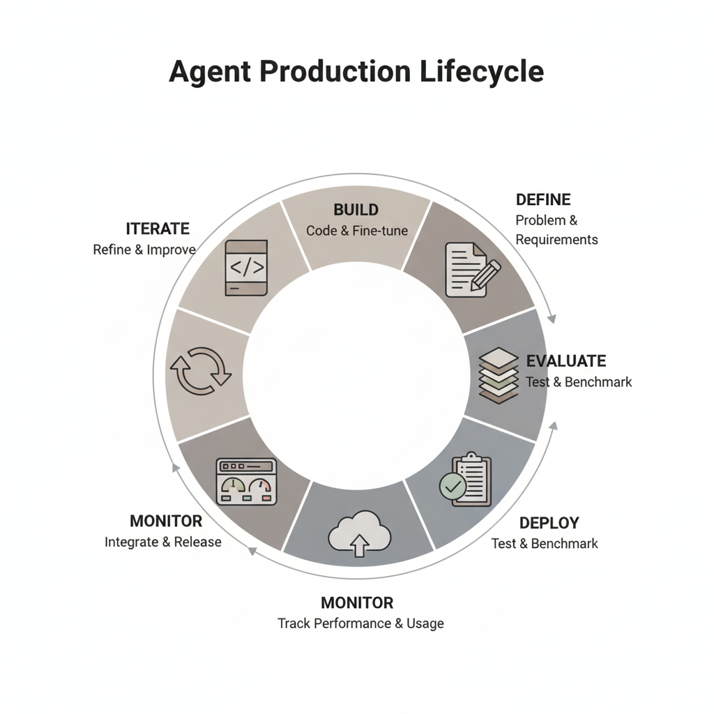
  <p style="margin-top: 15px; font-style: italic; color: #666;">Agent Production Lifecycle: A Continuous Loop</p>
</div>

### 7.1 Framework Selection Heuristic
```
IF (auditability + cyclic loops + resumability) THEN LangGraph
ELSE IF (enterprise collaboration + seamless HITL) THEN AutoGen
ELSE CrewAI (prioritize MVP velocity)
```

### 7.2 Role Definition, Tools, and Access Control (ABAC)
- Enforce **principle of least privilege** for tools (default-deny policies).
- Mandate JSON Schema for all tool I/O to prevent malformed interactions.
- Design actions as idempotent; implement retries with exponential backoff and jitter for fault tolerance.

### 7.3 Memory Management Protocols
- **Ingestion Policy:** Gate writes by confidence thresholds to curb noise.
- **Retrieval Filters:** Apply time-based decay, trust scores, and relevance tags.
- **Optimization:** Compress recurrent patterns into procedural macros for efficiency.

### 7.4 Built-in Observability
Instrument every `(Thought, Action, Observation)` triplet with embedded cost/latency tracking; apply PII redaction pipelines pre-persistence.

### 7.5 Governance Layer
Integrate conditional nodes for approvals, token budgets, circuit breakers, and pre-display content filters to enforce compliance at runtime.

---

## 8) 🧪 Real-World Applications

| Domain          | Key Agents                          | Quantifiable Impact                                                                 |
|-----------------|-------------------------------------|-------------------------------------------------------------------------------------|
| **Healthcare**  | DataAnalyser, EvidenceResearcher, DecisionSupport | 11–13% uplift in diagnostic precision for complex cases; diagnostic timelines reduced from hours to minutes. |
| **Finance**     | MarketAnalyser, RiskAssessor, PortfolioOptimiser | Continuous 24/7 market surveillance; automated safeguards on high-stakes trades.    |
| **Software Dev**| CodeAnalyser, UnitTester, DocGenerator | 70% decrease in manual code review cycles; accelerated iteration.                   |
| **Science**     | Researcher, Synthesiser, Validator  | Literature reviews compressed from months to days; automated research gap identification. |

---

## 9) 🔭 Future Research Directions

Emerging frontiers to watch:

- **Specialized Planners:** Reasoning-only models for ultra-efficient orchestration.
- **Diverse Teams:** Multilingual, culturally attuned agent ensembles.
- **Embodied Systems:** Agents integrated with physical robotics for real-world actuation.
- **Native Monitoring:** Built-in observability stacks tailored to agent lifecycles.
- **Privacy-First Knowledge:** Federated learning and secure RAG for compliant data handling.
- **Resource Economics:** Auction-based or credit systems for inter-agent allocation.

---

## 10) 🧩 Memory Systems & Knowledge Integration

<div style="text-align: center; margin: 30px 0; padding: 20px; border: 1px solid #e1e4e8; border-radius: 8px; background-color: #f6f8fa;">
  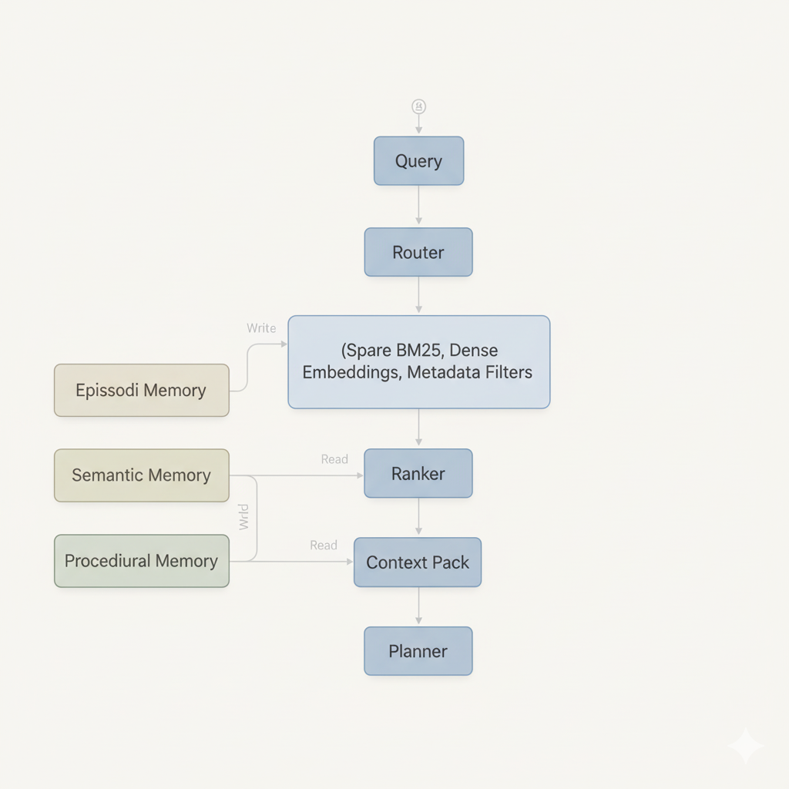
  <p style="margin-top: 15px; font-style: italic; color: #666;">Layered Memory Stack: Hybrid RAG Retrieval</p>
</div>

| Memory Type    | Content Focus                       | TTL     | Recommended Backend             |
|---------------|-------------------------------------|---------|---------------------------------|
| **Episodic**  | Task states, execution logs         | Short   | KV Store (e.g., Redis)          |
| **Semantic**  | Documents, factual embeddings       | Medium  | Vector DB (e.g., Chroma/Pinecone)|
| **Procedural**| Reusable skills and macros          | Long    | Registry/Database               |
| **Social**    | Peer capabilities and histories     | Medium  | Graph Database                  |

**Advanced Retrieval Strategies**
- **Hybrid Querying:** Combine dense embeddings, sparse keywords, and metadata filters → rerank → contextualize.
- **Memory-First Routing:** Query internal stores before external tools to leverage priors.
- **Hygiene Rules:** Deduplicate writes and consolidate episodes to prevent bloat.

---

## 11) 🛡️ Safety, Governance & Risk

- **Tool Safeguards:** Attribute-based access control (ABAC), minimal permissions, and curated allowlists.
- **Action Constraints:** Enforce preconditions (e.g., transaction limits), mandatory approvals, and throughput/risk caps.
- **Content Pipeline:** Sequential classify → redact → moderate → render for safe outputs.
- **Audit Trail:** Cryptographically signed logs, tamper-proof evidence chains, and deterministic replay.
- **Key Threats & Mitigations:** Prompt injection (via isolation/sanitization), data exfiltration (structural scrubbing), tool misuse (admission controllers).

---

## 12) ⚡ Cost, Latency & Scaling

- **Intelligent Routing:** Tiered models—inexpensive routers triage to compact planners, escalating to premium executors only as needed.
- **Aggressive Caching:** Soft-TTL stores for prompts, tool responses, and embeddings to reuse computations.
- **Concurrency Controls:** Tool-specific quotas, system-wide QPS limits, and overload shedding.
- **Efficiency Levers:** Batch vector operations; stream incremental results to end-users.
- **Budget Discipline:** Per-step token ceilings; disincentivize inefficient tool chaining.

---

## 13) 🔎 Observability & Incident Response

**Essential Pillars:**
- **Traces:** Granular spans across plans, tools, and memory accesses.
- **Metrics:** Aggregates for success rates, p95 latencies, and cost-per-outcome.
- **Alerts:** Proactive notifications on anomalies like budget overruns or repair spikes.

**Escalation Runbook:**
1. **Retry Logic:** Automated recovery for transient degradations.
2. **Model Fallback:** Downgrade to stable alternatives.
3. **Tool Isolation:** Quarantine suspect integrations.
4. **Human Escalation:** Route to HITL for edge cases.
5. **Root-Cause Analysis:** Conduct post-mortems to refine prompts, schemas, or tools.

---

## 14) 🧭 Reference Architectures

### 14.1 Audit-First Research Agent (LangGraph)
**Core Flow:** Ingest → Plan → Retrieve → Synthesize → Cite → Verify → Approve → Publish.  
**Safeguards:** Conditional approval before publishing; triple-failure circuit breaker reroutes to planning.

<div style="text-align: center; margin: 30px 0; padding: 20px; border: 1px solid #e1e4e8; border-radius: 8px; background-color: #f6f8fa;">
  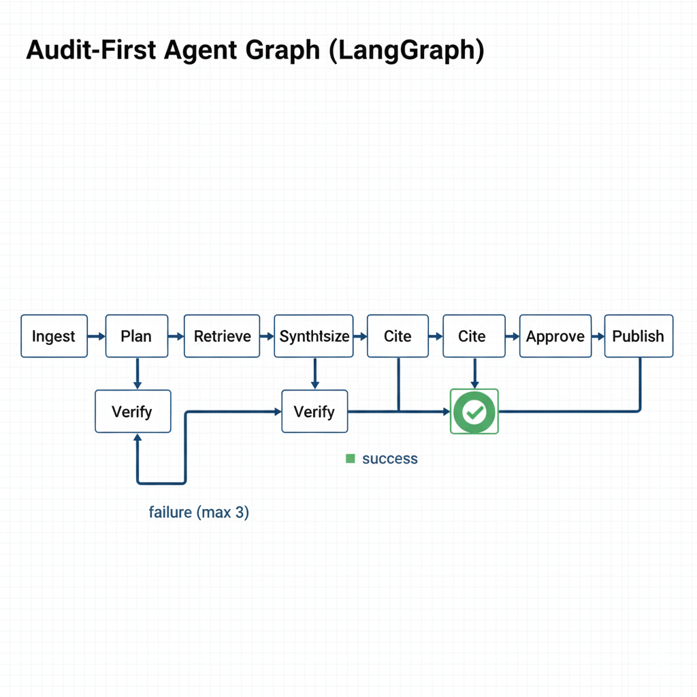
  <p style="margin-top: 15px; font-style: italic; color: #666;">LangGraph: Audit-First Research Agent Flow</p>
</div>

### 14.2 HITL Enterprise Team (AutoGen)
**Team Composition:** ResearchLead (discovery), CodeArchitect (implementation), RiskOfficer (vetting), UserProxy (gated termination).

<div style="text-align: center; margin: 30px 0; padding: 20px; border: 1px solid #e1e4e8; border-radius: 8px; background-color: #f6f8fa;">
  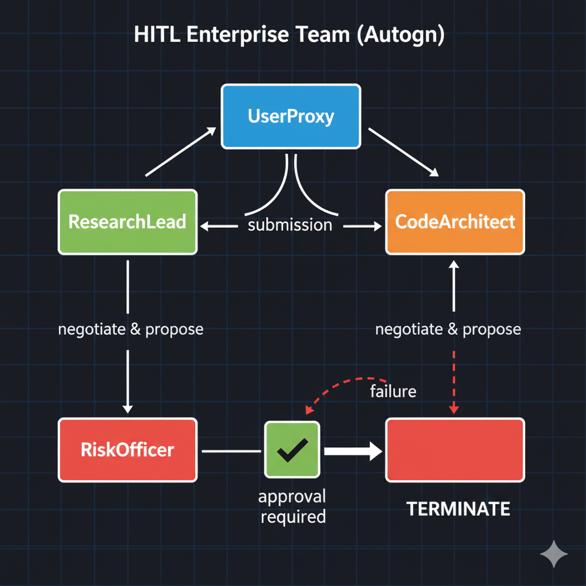
  <p style="margin-top: 15px; font-style: italic; color: #666;">AutoGen: HITL Enterprise Team Collaboration</p>
</div>

### 14.3 Rapid MVP Pipeline (CrewAI)
**Sequential Roles:** Analyst (research) → Writer (drafting) → Editor (refinement) → QA (validation), with artifact handoffs at each transition.

<div style="text-align: center; margin: 30px 0; padding: 20px; border: 1px solid #e1e4e8; border-radius: 8px; background-color: #f6f8fa;">
  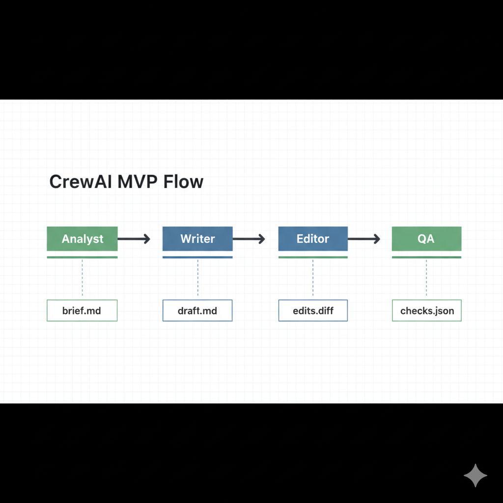
  <p style="margin-top: 15px; font-style: italic; color: #666;">CrewAI: Rapid MVP Pipeline</p>
</div>

---

## 15) 🧪 Playbooks & Checklists

### 15.1 Production Readiness Checklist
- [ ] All tools validated with JSON schemas.
- [ ] Guardrail nodes (approvals, breakers) fully implemented.
- [ ] Memory policies include confidence gating + PII scrubbing.
- [ ] End-to-end tracing + red-team stress testing complete.
- [ ] Cost controls and admission gates enforced.
- [ ] Incident runbooks and emergency kill switches documented.

### 15.2 Red-Teaming Prompts
- **Bypass Injection:** Craft prompts to evade approvals → Verify **denial** and logging.
- **Obfuscated Inputs:** Embed hidden directives in markup → Confirm **sanitization** and isolation.
- **Resource Exhaustion:** Simulate over-budget scenarios → Ensure **shedding** and HITL escalation.

### 15.3 Lightweight Evaluation Stub (Pseudo-Code)
```python
for task in benchmark_suite:
    execution = agent.execute(task, max_budget=tool_quota)
    trace_logger.record(execution.trace)
    assert execution.success or execution.repairs < 3, "Threshold exceeded"
```

---

## 📚 Glossary
- **Admission Control:** Policy layer for vetting tool invocations (approve/deny with audit rationale).
- **Plan Repair:** In-loop adjustment of trajectories post-failure for continued progress.
- **Procedural Memory:** Catalog of callable routines distilling repeated workflows.
- **Safety Edge:** Conditional graph transition enforcing pre-action validations.

---

### 🙌 Contributing
1. Fork the repo and branch from `main`.
2. Enhance sections or visuals (preserve prompt reproducibility).
3. Submit PRs with diff visuals and rationale.

[Contribute on GitHub](https://github.com/your-repo/ai-agents-report)

---

### 📄 Citation
> Cite as: *Agentic Research Initiative (2025). “AI Agents & Multi-Agent Systems.”* CC BY 4.0.

<div style="border-top: 1px solid #eee; padding-top: 20px; text-align: center; color: #666; font-size: 0.9em;">
  <p>Generated with ❤️ By Ajmal U K</p>
</div>
